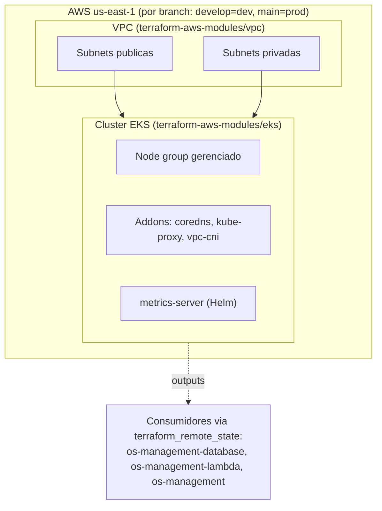

# os-management-k8s-terraform

Responsável pela **rede compartilhada (VPC) + cluster EKS** da plataforma OS Management, um
ambiente por branch:

| Branch | Ambiente | Conta AWS | Chave de state |
|---|---|---|---|
| `develop` | dev | conta dev | `k8s/develop/terraform.tfstate` |
| `main` | prod | conta prod | `k8s/main/terraform.tfstate` |

## Arquitetura



Este repositório é dono apenas da rede compartilhada e do cluster — ele **não**
faz deploy da aplicação, do banco de dados ou das funções Lambda. Esses vivem em
seus próprios repositórios e leem os outputs deste stack (`vpc_id`,
`private_subnet_ids`, `node_security_group_id`, `cluster_name`) via
`terraform_remote_state`.

## O que ele cria
- VPC (subnets públicas + privadas, um único NAT por padrão) via `terraform-aws-modules/vpc`.
- Cluster EKS + node group gerenciado via `terraform-aws-modules/eks`, com os addons
  `coredns`, `kube-proxy`, `vpc-cni`.
- `metrics-server` (Helm) — pré-requisito do cluster para o HPA da aplicação. O manifesto do
  HPA em si vive no repositório da aplicação (`os-management`).

## Consumido por (via `terraform_remote_state`)
- **os-management-database** → `private_subnet_ids`, `node_security_group_id`, `vpc_id`.
- **os-management-lambda** → `private_subnet_ids`, `node_security_group_id`.
- **os-management** (app) → `cluster_name` (para `aws eks update-kubeconfig`).

## Outputs
`vpc_id`, `private_subnet_ids`, `public_subnet_ids`, `node_security_group_id`,
`cluster_name`, `cluster_endpoint`, `cluster_ca_certificate` (sensível), `region`.

## Configuração
Autenticação AWS/conta/bucket de state compartilhados vêm de **secrets de nível de
organização**, sufixados por branch (`*_MAIN` / `*_DEVELOP`); `AWS_REGION` é um único
secret de organização compartilhado pelas duas branches (sem sufixo). Ver `DEPENDENCIES.md`
§5 no repositório da aplicação para a matriz completa.

## Uso Local
```bash
cp terraform.tfvars.example terraform.tfvars   # edite os valores
terraform init -backend=false                  # apenas validação (sem remote state)
terraform validate
```
Os `apply` reais rodam na CI (`.github/workflows/cd.yml`) em pushes para `develop`/`main`.

## Notas

- Lembrar de adicionar o usuário **`soat-architecture`** a este repositório (requisito de
  entrega do Tech Challenge).
